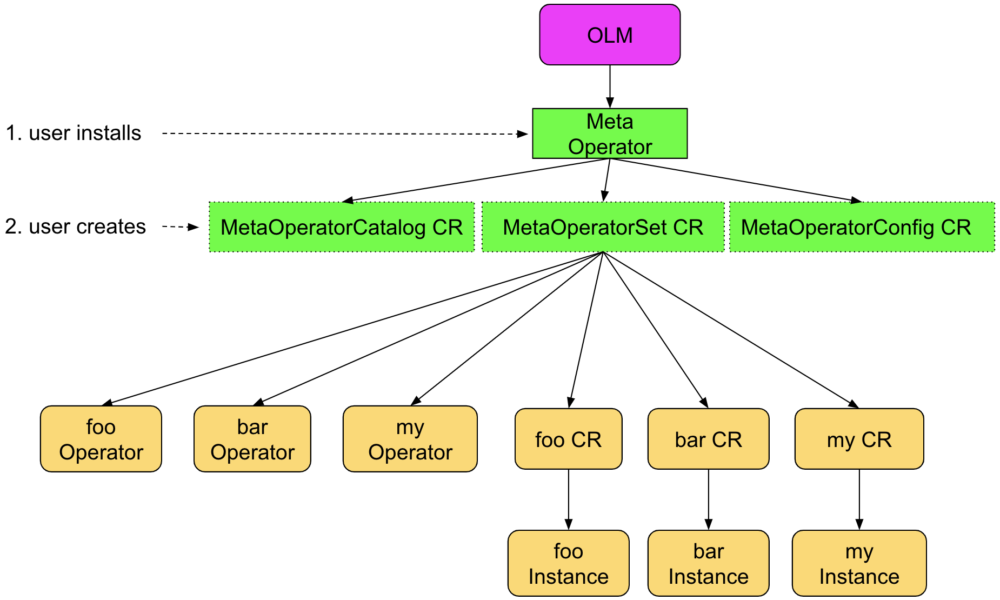

<!-- START doctoc generated TOC please keep comment here to allow auto update -->
<!-- DON'T EDIT THIS SECTION, INSTEAD RE-RUN doctoc TO UPDATE -->
**Table of Contents**  *generated with [DocToc](https://github.com/thlorenz/doctoc)*

- [Meta Operator](#meta-operator)
  - [Goal](#goal)
  - [Meta Operator Workflow](#meta-operator-workflow)
  - [MetaOperatorCatalog Spec](#metaoperatorcatalog-spec)
  - [MetaOperatorConfig Spec](#metaoperatorconfig-spec)
    - [How does Operator create the individual operator CR?](#how-does-operator-create-the-individual-operator-cr)
  - [MetaOperatorSet Spec](#metaoperatorset-spec)
    - [Dependencies](#dependencies)
  - [E2E Use Case](#e2e-use-case)

<!-- END doctoc generated TOC please keep comment here to allow auto update -->

# Meta Operator

Meta Operator is used to manage the lifecycle of for a group of operators, it is kind of operator for operators model.

The Meta Operator will have three CRDs:

* MetaOperatorCatalog, defines the individual operator info
* MetaOperatorConfig, defines the individual operator CR info
* MetaOperatorSet, defines the individual operator state


## Goal

1. A single entrypoint to manage a group of operators
1. User can select a set of operators to install
1. The install can be invoked through either OCP UI or CLI

## Meta Operator Workflow




## MetaOperatorCatalog Spec

MetaOperatorCatalog defines the individual operator info:

* namespace, the namespace of the individual operator
* channel, the channel(version) of the individual operator
* packageName, the package name in operator registry of the individual operator
* sourceName, the name of operator registry
* sourceNamespace, the namespace of operator registry

The MetaOperatorCatalog managed operator subscriptions will have a label `"operator.ibm.com/css-control": "true"`, we use this label to distinguish if an operator is managed by MetaOperatorCatalog or not.

> **NOTE: These operators will not be installed by default, unless you explicitly set the state to present**

```yaml
apiVersion: operator.ibm.com/v1alpha1
kind: MetaOperatorCatalog
metadata:
  name: common-service
spec:
  operators:
  - name: mongodb
    namespace: ibmcs-mongodb
    channel: stable-3.3
    packageName: mongodb
    sourceName: ibmcloud-operators
    sourceNamespace: openshift-marketplace
  - name: iam
    namespace: ibmcs-iam
    channel: stable-3.3
    packageName: iam
    sourceName: ibmcloud-operators
    sourceNamespace: openshift-marketplace
  - name: kui
    namespace: ibmcs-kui
    channel: stable-3.4
    packageName: kui
    sourceName: ibmcloud-operators
    sourceNamespace: openshift-marketplace
  - name: metering
    namespace: ibmcs-metering
    channel: stable-3.5
    packageName: metering
    sourceName: ibmcloud-operators
    sourceNamespace: openshift-marketplace
```

## MetaOperatorConfig Spec

MetaOperatorConfig defines the individual operator CR info:

* name, the individual operator name
* spec, the parameters that used to generate the CR

```yaml
apiVersion: operator.ibm.com/v1alpha1
Kind: MetaOperatorConfig
metadata:
  name: common-service
spec:
  services:
  # suppose mongodb has one CRD
  - name: mongodb
    spec:
      mongodb:
        storageClass: rook-ceph
  # suppose iam has two CRDs
  - name: iam
    spec:
      apikey:
        key: value
        nested:
          key: value
      identity:
        key: value
  # suppose metering has three CRDs
  - name: metering
    spec:
      reader:
        key: value
        nested:
          key: value
      server:
        key: value
        nested:
          key: value
      dataManager:
        key: value
        nested:
          key: value
  - name: monitoring
    spec:
      monitor: {}
```

### How does Operator create the individual operator CR?

Suppose IAM Operator has two CRDs: Apikey and Identity:

1. The MetaOperatorConfig CR has

    ```yaml
    - name: iam
      spec:
        apikey:
          key: value
          nested:
            key: value
        identity:
          key: value
    ```

2. The IAM Operator CSV has

    ```yaml
    apiVersion: operators.coreos.com/v1alpha1
    kind: ClusterServiceVersion
    metadata:
      annotations:
        alm-examples: |-
          [
            {
              "apiVersion": "iam.operator.ibm.com/v1alpha1",
              "kind": "Apikey",
              "metadata": {
                "name": "iam-apikey"
              },
              "spec": {
                "key": "value",
                "nested": {
                  "key": "value"
                }
              }
            },
            {
              "apiVersion": "iam.operator.ibm.com/v1alpha1",
              "kind": "Identity",
              "metadata": {
                "name": "iam-identity"
              },
              "spec": {
                "key": "value",
                "nested": {
                  "key": "value"
                }
              }
            }
          ]
    ```

3. The Meta Operator will deep merge the MetaOperatorConfig CR spec and IAM Operator CSV alm-examples to create the IAM CR.

4. For day2 operations, the Meta Operator will patch the MetaOperatorConfig CR spec to the existing IAM CR.

    Usually the user should update the individual operator CR for day2 operations, but Meta Operator still provide the ability for individual operator day2 operation.


## MetaOperatorSet Spec

MetaOperatorSet defines the individual operator state, such as an individual operator should be present or absent.

* name, the name of the individual operator
* channel, optional parameter, the subscription channel(version) of the individual operator
* state, the state of the individual operator

```yaml
apiVersion: operator.ibm.com/v1alpha1
Kind: MetaOperatorSet
metadata:
  name: common-service
spec:
  services:
  - name: monitoring
    channel: stable-3.4
    state: present
    description: The IBM Monitoring service
  - name: metering
    channel: stable-3.5
    state: absent
    description: The IBM Metering service
```


### Dependencies

There are many operators and some of them have dependencies, but we don't support dependencies in meta operator, because:

1. Meta operator supports a single service with multiple versions, each version may have different dependencies
2. Each operator are designed to be a micro-service, the micro-service should manage dependencies by itself, such as don't start and throw error message when dependencies are not installed

## E2E Use Case

1. User installs Meta Operator from OLM

    The Meta Operator will automatically generate two default CRD CRs, since MetaOperatorCatalog and MetaOperatorConfig CRs don't define the state, so it should be fine.

2. Optional: User update the MetaOperatorConfig CR with their own parameter values

    This should be optional if the default configurations match the requirement.

3. User creates the MetaOperatorSet CR from OLM

    This tells Meta Operator that users want to install some of the individual operators.

4. The rest works will be done by OLM and Meta Operator

    And finally user will get what they want.