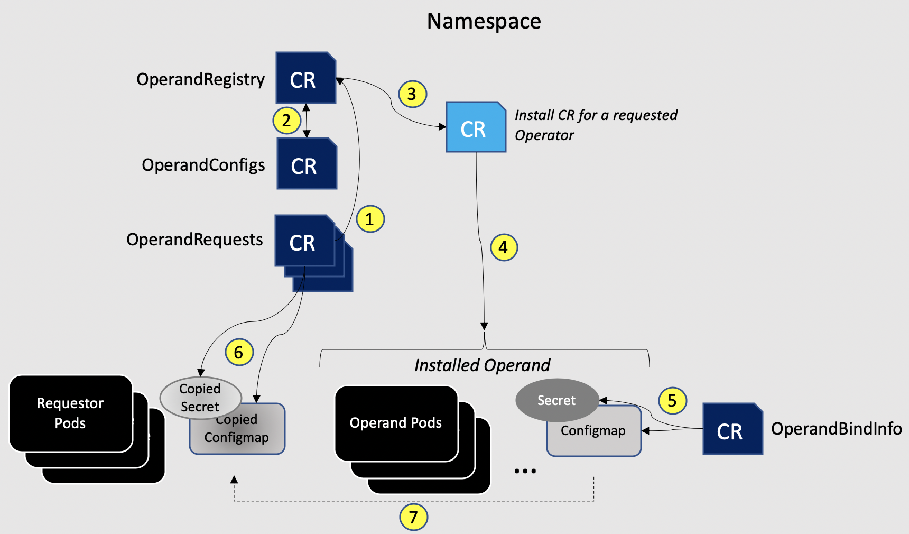

<!-- START doctoc generated TOC please keep comment here to allow auto update -->
<!-- DON'T EDIT THIS SECTION, INSTEAD RE-RUN doctoc TO UPDATE -->
**Table of Contents**  *generated with [DocToc](https://github.com/thlorenz/doctoc)*

- [Operand Deployment Lifecycle Manager (ODLM)](#operand-deployment-lifecycle-manager-odlm)
  - [What are operands?](#what-are-operands)
  - [Goal](#goal)
  - [ODLM Workflow](#odlm-workflow)
  - [OperandRegistry Spec](#operandregistry-spec)
  - [OperandConfig Spec](#operandconfig-spec)
    - [How does Operator create the individual operator CR](#how-does-operator-create-the-individual-operator-cr)
  - [OperandRequest Spec](#operandrequest-spec)
    - [OperandRequest sample to create custom resource via OperandConfig](#operandrequest-sample-to-create-custom-resource-via-operandconfig)
    - [OperandRequest sample to create custom resource via OperandRequest](#operandrequest-sample-to-create-custom-resource-via-operandrequest)
  - [OperandBindInfo Spec](#operandbindinfo-spec)
  - [E2E Use Case](#e2e-use-case)
  - [Operator/Operand Upgrade](#operatoroperand-upgrade)

<!-- END doctoc generated TOC please keep comment here to allow auto update -->

# Operand Deployment Lifecycle Manager (ODLM)

The operand is the instance managed by the operator. ODLM is used to manage the lifecycle of for a group of operands, compared with operator lifecycle manager, ODLM focus on the management of operands but not operators.

## What are operands?

Operator is a method of packaging, deploying and managing a Kubernetes application.
Operands are the services and applications that Operator manage.

For example, cert-manager operator deploys a cert-manager deployment, then the cert-manager-operator is an operator and the cert-manager deployment is an operand.

The ODLM will have four CRDs:

| Resource                 | Short Name | Description                                                                                |
|--------------------------|------------|--------------------------------------------------------------------------------------------|
| OperandRequest | opreq | It defines which operator/operand want to be installed in the cluster |
| OperandRegistry | opreg | It defines the OLM information, like channel and catalog source, for each operator |
| OperandConfig | opcon | It defines the parameters that should be used to install the operator's operand |
| OperandBindInfo | opbi | It identifies secrets and/or configmaps that should be shared with requests |

## Goal

1. A single entry point to manage a group of operands
1. User can select a set of operands to install
1. The install can be invoked through either OCP UI or CLI

## ODLM Workflow



## OperandRegistry Spec

OperandRegistry defines the OLM information used for installation, like package name and catalog source, for each operator.

Following is an example of the OperandRegistry CR:

**NOTE:** The "spec.operators[*].name" parameter must be unique for each entry.

```yaml
apiVersion: operator.ibm.com/v1alpha1
kind: OperandRegistry
metadata:
  name: example-service [1]
  namespace: example-service-ns [2]
spec:
  operators:
  - name: jenkins [3]
    namespace: default [4]
    channel: alpha [5]
    packageName: jenkins-operator [6]
    scope: public [7]
    sourceName: community-operators [8]
    sourceNamespace: openshift-marketplace [9]
    installMode: cluster [10]
    installPlanApproval: Manual [11]
```

The OperandRegistry Custom Resource (CR) lists OLM Operator information for operands that may be requested for installation and/or access by an application that runs in a namespace. The registry CR specifies:

1. `name` of the OperandRegistry
2. `namespace` of the OperandRegistry
3. `name` is the name of the operator, which should be the same as the services name in the OperandConfig and OperandRequest.
4. (optional) `namespace` defines the namespace where the operator will be deployed. (1) When InstallMode is `cluster`, the operator will be deployed into the `openshift-operators` namespace. (2) When InstallMode is empty or set to `namespace`, it is the namespace where operator will be deployed. (3) If the `namespace` value is empty, the operator will be deployed in the same namespace as this OperandRegistry.
5. `channel` is the name of OLM channel that is subscribed for the operator.
6. `packageName` is the name of the package in CatalogSource that is subscribed for the operator.
7. (optional) `scope` is an indicator, either public or private, that dictates whether deployment can be requested from other namespaces (public) or only from the namespace of this OperandRegistry (private). The default value is private.
8. `sourceName` is the name of the CatalogSource.
9. `sourceNamespace` is the namespace of the CatalogSource.
10. (optional) `installMode` is the install mode of the operator, can be `namespace` (OLM one namespace), `cluster` (OLM all namespaces) or `no-op` (discontinued service). The default value is `namespace`. Operator is deployed in `openshift-operators` namespace when InstallMode is set to `cluster`.
11. (optional) `installPlanApproval` is the approval mode for emitted installplan. The default value is `Automatic`.

## OperandConfig Spec

OperandConfig defines the individual operand configuration. The OperandConfig Custom Resource (CR) defines the parameters for each operator that is listed in the OperandRegistry that should be used to install the operator instance by specifying an installation CR.

```yaml
apiVersion: operator.ibm.com/v1alpha1
Kind: OperandConfigs
metadata:
  name: example-service [1]
  namespace: example-service-ns [2]
spec:
  services:
  - name: jenkins [3]
    spec: [4]
      jenkins:
        port: 8081
```

OperandConfig defines the individual operand deployment config:

1. `name` of the OperandConfig
2. `namespace` of the OperandConfig
3. `name` is the name of the operator, which should be the same as the services name in the OperandRegistry and OperandRequest.
4. `spec` defines a map. Its key is the kind name of the custom resource. Its value is merged to the spec field of custom resource. For more details, you can check the following topic **How does ODLM create the individual operator CR?**

### How does Operator create the individual operator CR

Jenkins Operator has one CRD: Jenkins:

The OperandConfig CR has

```yaml
- name: jenkins
  spec:
    jenkins:
      service:
        port: 8081
```

The Jenkins Operator CSV has

```yaml
apiVersion: operators.coreos.com/v1alpha1
kind: ClusterServiceVersion
metadata:
  annotations:
   alm-examples: |-
    [
     {
       "apiVersion":"jenkins.io/v1alpha2",
       "kind":"Jenkins",
       "metadata": {
         "name":"example"
       },
       "spec":{
         ...
         "service":{"port":8080,"type":"ClusterIP"},
         ...
       }
     }
  ]
```

The ODLM will deep merge the OperandConfig CR spec and Jenkins Operator CSV alm-examples to create the Jenkins CR.

```yaml
apiVersion: jenkins.io/v1alpha2
kind: Jenkins
metadata:
  name: example
spec:
  ...
  service:
    port: 8081
    type: ClusterIP
  ...
```

For day2 operations, the ODLM will patch the OperandConfigs CR spec to the existing Jenkins CR.

## OperandRequest Spec

OperandRequest defines which operator/operand you want to install in the cluster.

**NOTE:** OperandRequest custom resource is used to trigger a deployment for Operators and Operands.

### OperandRequest sample to create custom resource via OperandConfig

```yaml
apiVersion: operator.ibm.com/v1alpha1
kind: OperandRequest
metadata:
  name: example-service [1]
  namespace: example-service-ns [2]
spec:
  requests:
  - registry: example-service [3]
    registryNamespace: example-service-ns [4]
    operands: [5]
    - name: jenkins [6]
      bindings: [7]
        public:
          secret: jenkins-operator-credential [8]
          configmap: jenkins-operator-base-configuration [9]
```

1. `name` of the OperandRequest
2. `namespace` of the OperandRequest
3. `registry` identifies the name of the OperandRegistry CR from which this operand deployment is being requested.
4. (optional) `registryNamespace` identifies the namespace in which the OperandRegistry CR is defined. **Note:** If the `registryNamespace` is not specified then it is assumed that the OperandRegistry CR is in the current (OperandRequest's) namespace.
5. `operands` in the CR is a list of operands.
6. `name` of operands in the CR must match a name specification in an OperandRegistry's CR.
7. (optional) The `bindings` of the operands is a map to get and rename the secret and/or configmap from the provider and create them in the requester's namespace. If the requester wants to rename the secret and/or configmap, they need to know the key of the binding in the OperandBindInfo. If the key of the bindings map is prefixed with public, it means the secret and/or configmap can be shared with the requester in the other namespace. If the key of the bindings map is prefixed with private, it means the secret and/or configmap can only be shared within its own namespace.
8. (optional) `secret` names a secret that should be created in the requester's namespace with formatted data that can be used to interact with the service.
9. (optional) `configmap` names a configmap that should be created in the requester's namespace with formatted data that can be used to interact with the service.

### OperandRequest sample to create custom resource via OperandRequest

```yaml
apiVersion: operator.ibm.com/v1alpha1
kind: OperandRequest
metadata:
  name: example-service
  namespace: example-service-ns
spec:
  requests:
  - registry: example-service
    registryNamespace: example-service-ns
    operands:
    - name: jenkins
      kind: Jenkins [1]
      apiVersion: "jenkins.io/v1alpha2" [2]
      instanceName: "example" [3]
      spec: [4]
        service:
          port: 8081
```

1. `kind` of the target custom resource. If it is set in the operand item, ODLM will create CR according to OperandRequest only and get rid of the alm-example and OperandConfig.
2. `apiVersion` of the target custom resource.
3. `instanceName` is the name of the custom resource. If `instanceName` is not set, the name of the custom resource will be created with the name of the OperandRequest as a prefix.
4. `spec` is the spec field of the target CR.

## OperandBindInfo Spec

The ODLM will use the OperandBindInfo to copy the generated secret and/or configmap to a requester's namespace when a service is requested with the OperandRequest CR. An example specification for an OperandBindInfo CR is shown below.

```yaml
apiVersion: operator.ibm.com/v1alpha1
kind: OperandBindInfo
metadata:
  name: publicjenkinsbinding [1]
  namespace: example-service-ns [2]
spec:
  operand: jenkins [3]
  registry: example-service [4]
  registryNamespace: example-service-ns [5]
  description: "Binding information that should be accessible to jenkins adopters" [6]
  bindings: [7]
    public:
      secret: jenkins-operator-credentials-example [8]
      configmap: jenkins-operator-base-configuration-example [9]
```

Fields in this CR are described below.

1. `name` of the OperandBindInfo
2. `namespace` of the OperandBindInfo
3. The `operand` should be the the individual operator name.
4. The `registry` identifies the name of the OperandRegistry CR in which this operand information is registered.
5. (optional) `registryNamespace` identifies the namespace in which the OperandRegistry CR is defined. **Note:** If the `registryNamespace` is not specified then it is assumed that the OperandRegistry CR is in the current (OperandBindInfo's) namespace.
6. `description` is used to add a detailed description of a service.
7. The `bindings` section is used to specify information about the access/configuration data that is to be shared. If the key of the bindings map is prefixed with public, it means the secret and/or configmap can be shared with the requester in the other namespace. If the key of the bindings map is prefixed with private, it means the secret and/or configmap can only be shared within its own namespace. If the key of the bindings map is prefixed with protected, it means the secret and/or configmap can only be shared if it is explicitly declared in the OperandRequest.
8. The `secret` field names an existing secret, if any, that has been created and holds information that is to be shared with the requester.
9. The `configmap` field identifies a configmap object, if any, that should be shared with the requester

ODLM will use the OperandBindInfo CR to pass information to an adopter when they create a OperandRequest to access the service, assuming that both have compatible scopes. ODLM will copy the information from the shared service's "OperandBindInfo.bindinfo[].secret" and/or "OperandBindInfo.bindinfo[].configmap" to the requester namespace.

**NOTE:** If in the OperandRequest, there is no secret and/or configmap name specified in the bindings or no bindings field in the element of operands, ODLM will copy the secret and/or configmap to the requester's namespace and rename them to the name of the OperandBindInfo + secret/configmap name.

## E2E Use Case

1. User installs ODLM from OLM

    The ODLM will automatically generate two default CRD CRs, since OperandRegistry and OperandConfigs CRs don't define the state, so it should be fine.

2. **Optional:** Users can update the OperandConfigs CR with their own parameter values

    Users can skip this step if the default configurations match the requirement.

3. User creates the OperandRequest CR from OLM

    This tells ODLM that users want to install some of the individual operator/operand.

4. The rest works will be done by OLM and ODLM

    Finally, users will get what they want.

## Operator/Operand Upgrade

- For operator/operand upgrade, you only need to publish your operator OLM to your operator channel, and OLM will handle the upgrade automatically.
- If there are major version, then you may want to update `channel` in `OperandRegistry` to trigger upgrade.
