<!-- START doctoc generated TOC please keep comment here to allow auto update -->
<!-- DON'T EDIT THIS SECTION, INSTEAD RE-RUN doctoc TO UPDATE -->
**Table of Contents**  *generated with [DocToc](https://github.com/thlorenz/doctoc)*

- [Install the operand deployment lifecycle manager On OCP 4.2+](#install-the-operand-deployment-lifecycle-manager-on-ocp-42)
  - [1. Create OperatorSource](#1-create-operatorsource)
  - [2. Create a Namespace `ibm-common-services`](#2-create-a-namespace-ibm-common-services)
  - [3. Install operand deployment lifecycle manager](#3-install-operand-deployment-lifecycle-manager)
    - [Search ODLM Package in the OperatorHub](#search-odlm-package-in-the-operatorhub)
    - [Install ODLM Operator](#install-odlm-operator)
  - [4. Manage Other Operators with ODLM](#4-manage-other-operators-with-odlm)
    - [Create Operand Request](#create-operand-request)
    - [Enable or Delete an Operator](#enable-or-delete-an-operator)
- [Post-installation](#post-installation)

<!-- END doctoc generated TOC please keep comment here to allow auto update -->

# Install the operand deployment lifecycle manager On OCP 4.2+

## 1. Create OperatorSource

Before install ODLM, this operator source should be created to get operator bundles from `quay.io`.

```yaml
apiVersion: operators.coreos.com/v1
kind: OperatorSource
metadata:
  name: opencloud-operators
  namespace: openshift-marketplace
spec:
  authorizationToken: {}
  displayName: IBMCS Operators
  endpoint: https://quay.io/cnr
  publisher: IBM
  registryNamespace: opencloudio
  type: appregistry
```

Click the plus button, and then copy the above operator source into the editor.
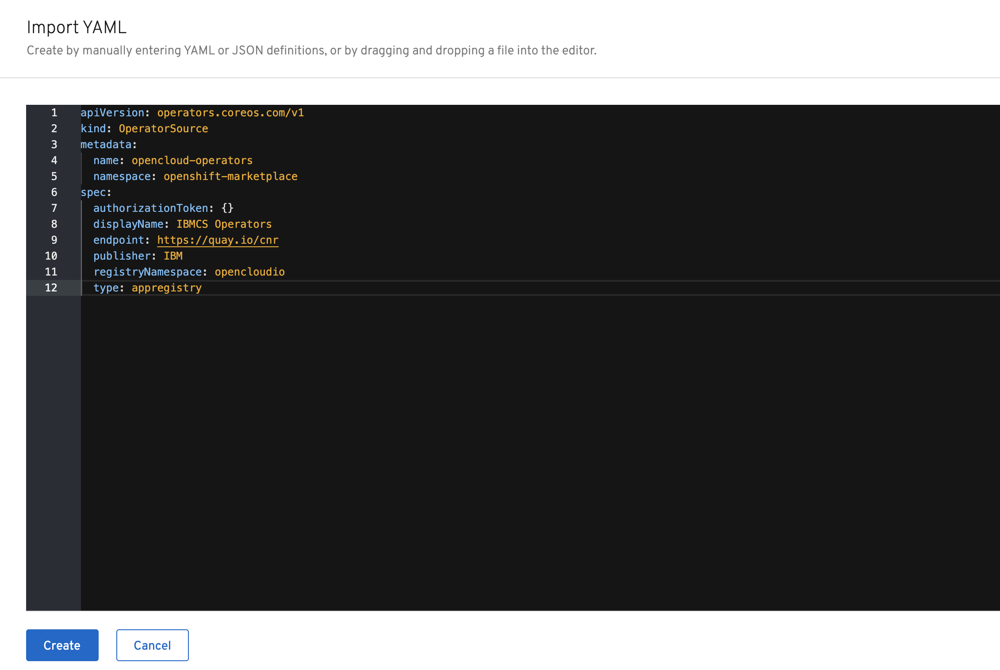

Check if operator packages are loaded, run command:

```bash
oc -n openshift-marketplace get operatorsource opencloud-operators -o jsonpath="{.status.packages}"
```

The output is a list of operators

```yaml
ibm-monitoring-prometheusext-operator-app,ibm-meta-operator-bridge-app,cp4foobar-operator-app,ibm-cert-manager-operator-app,ibm-management-ingress-operator-app,ibm-mgmt-repo-operator-app,ibm-platform-api-operator-app,ibm-ingress-nginx-operator-app,ibm-commonui-operator-app-test,ibm-auditlogging-operator-app,ibm-commonui-operator-app,operand-deployment-lifecycle-manager-app,ibm-healthcheck-operator-app,ibm-monitoring-exporters-operator-app,ibm-iam-operator-app,ibm-mongodb-operator-app,ibm-monitoring-grafana-operator-app,ibm-metering-operator-app,ibm-helm-repo-operator-app,ibm-helm-api-operator-app,ibm-catalog-ui-operator-app,ibm-licensing-operator-app,ibm-elastic-stack-operator-app
```

**Note:** During development, if you need to update the csv package frequently, but the operator source needs a long time to sync the new package, you can delete the catalog source to trigger a reload. Then the new packages will be updated immediately.

```bash
oc delete catalogsource opencloudio -n openshift-marketplace
```

## 2. Create Namespace `ibm-common-services`

Open the `OperatorHub` page in OCP console left menu, then `Create Project`, e.g., create a project named `ibm-common-services`.

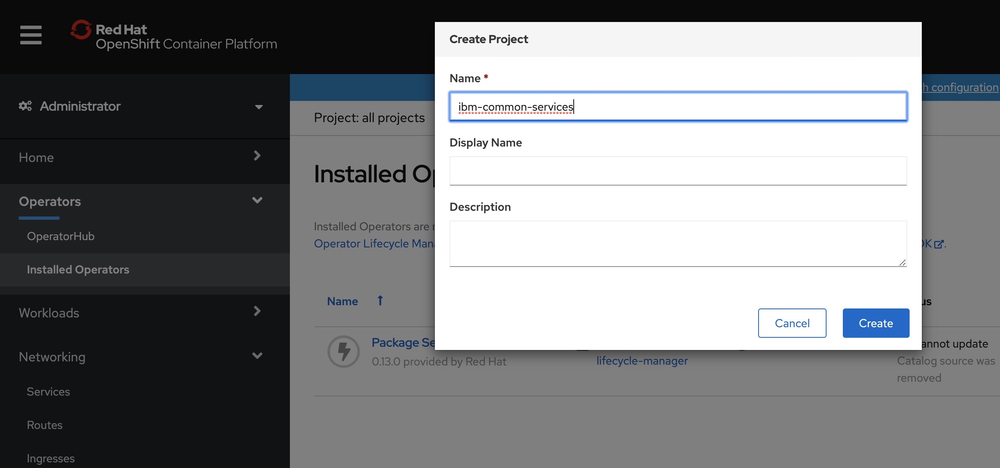

## 3. Install operand deployment lifecycle manager

### Search ODLM Package in the OperatorHub

Type `operand-deployment-lifecycle-manager` in the search box
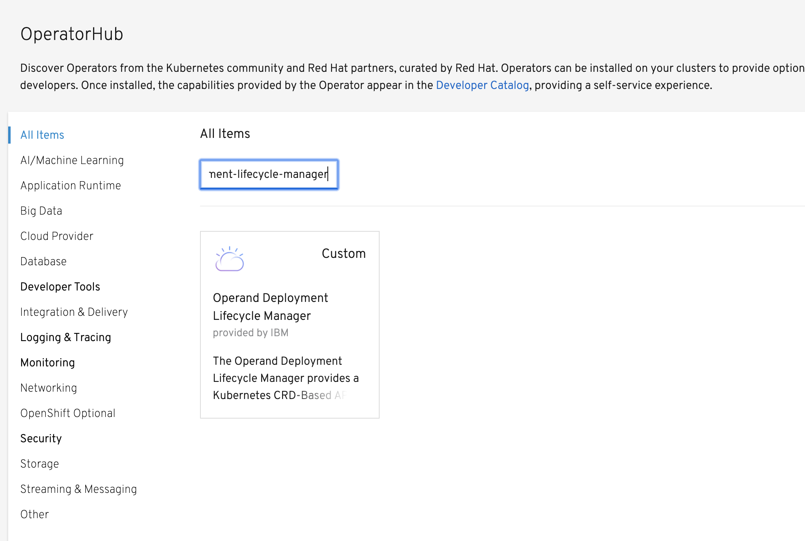Open `OperatorHub` and search `operand-deployment-lifecycle-manager` to find the operator, and install it.

### Install ODLM Operator

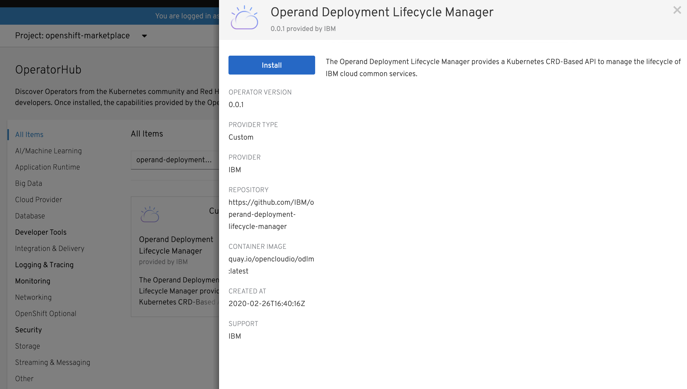

Select the namespace `ibm-common-services` that created in step [Create Project](#create-project)
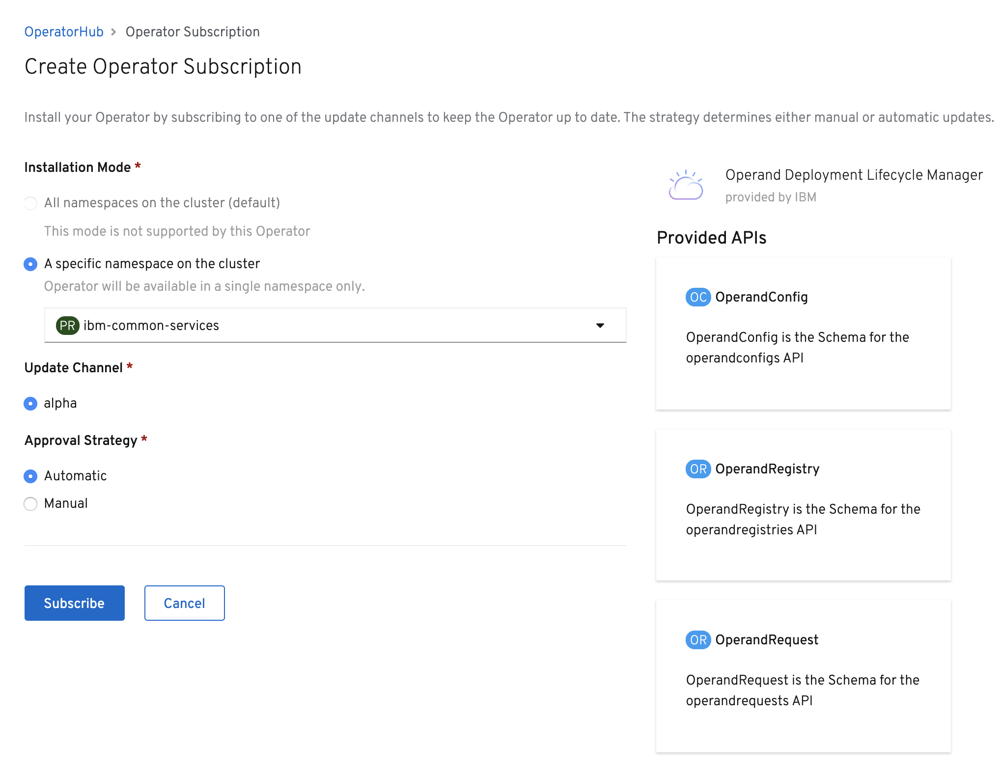
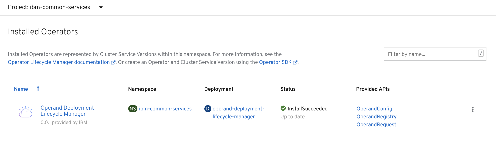

Waiting for about 1 minute, `OperandRegistry` and `OperandConfig` operand will be ready.
Sometimes, you need to refresh the webpage to check them.
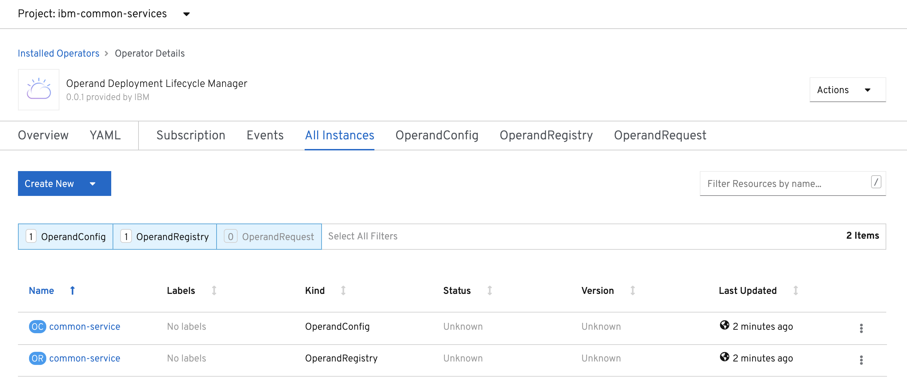

So far, the ODLM operator installation is completed. Next, you can start to install other common service operators.

## 4. Manage Other Operators with ODLM

### Create Operand Request

Select `OperandRequest` from `Create New` button
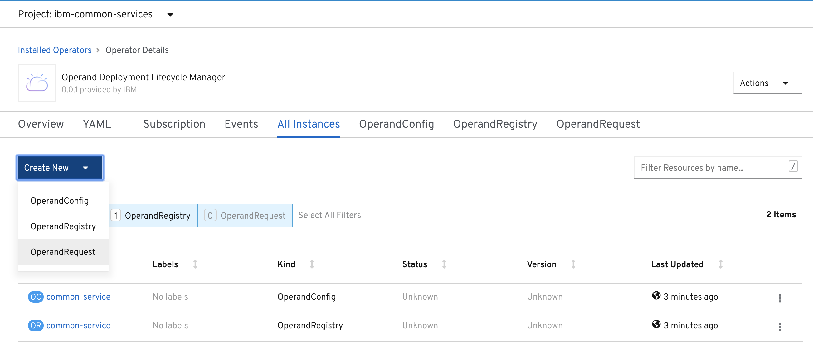

Modify the `OperandRequest` to add the operator you want to install into `spec.requests.operands`
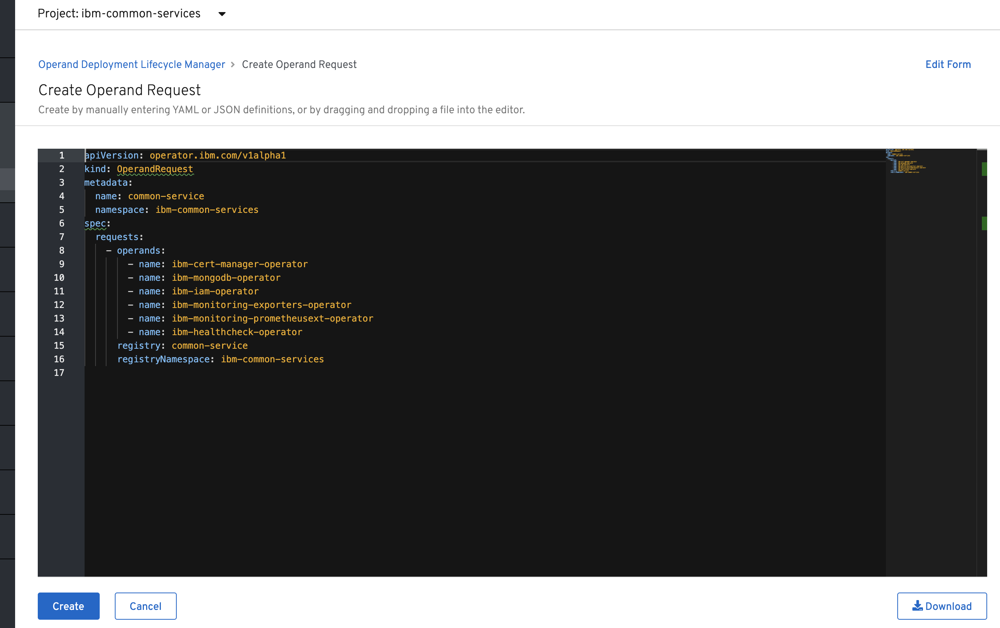
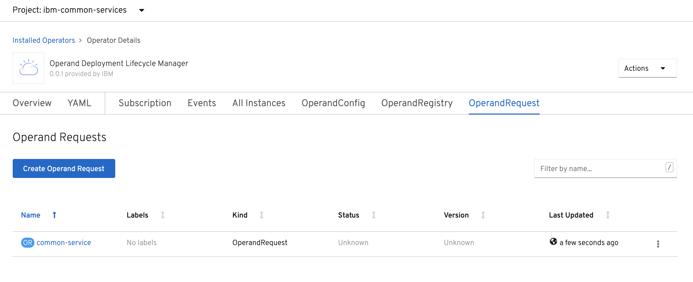

This is the list of operators are going to be installed:

```bash
    - name: ibm-cert-manager-operator
    - name: ibm-mongodb-operator
    - name: ibm-iam-operator
    - name: ibm-monitoring-exporters-operator
    - name: ibm-monitoring-prometheusext-operator
    - name: ibm-monitoring-grafana-operator
    - name: ibm-healthcheck-operator
    - name: ibm-management-ingress-operator
    - name: ibm-licensing-operator
    - name: ibm-metering-operator
    - name: ibm-commonui-operator
    - name: ibm-elastic-stack-operator
    - name: ibm-ingress-nginx-operator
    - name: ibm-auditlogging-operator
    - name: ibm-platform-api-operator
    - name: ibm-helm-api-operator
    - name: ibm-helm-repo-operator
    - name: ibm-catalog-ui-operator
```

After the `OperandRequest` created, you can click the left navigation tree `Installed Operators` to check if our common services install successfully.
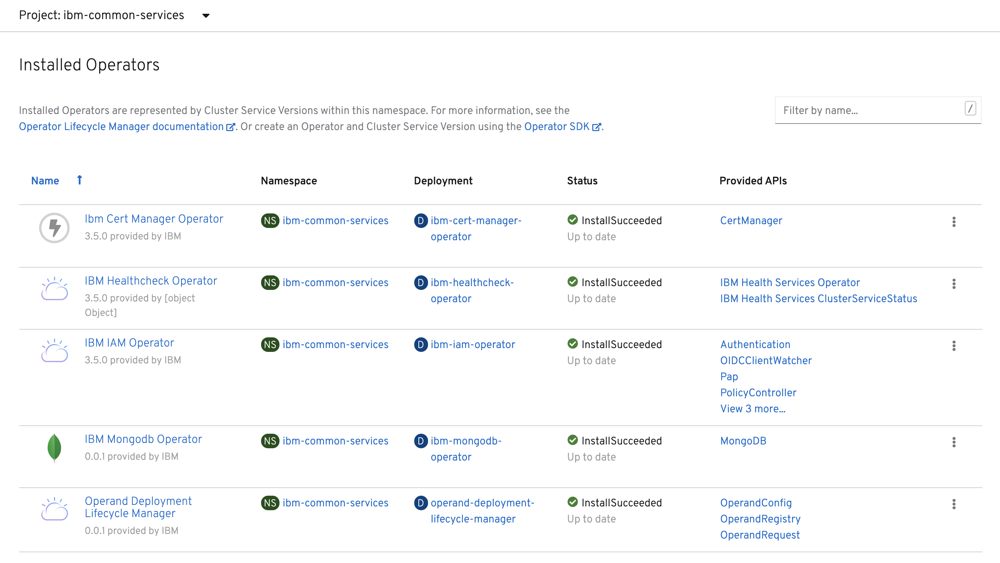

### Enable or Delete an Operator

- Enable an operator, you can add the operator into the `OperandRequest`

- Delete an operator, you can remove the operator from the`OperandRequest`

# Post-installation

The operators and their operands would be deployed in the cluster.

You can edit `OperandRegistry` instances to update operators.
You can edit `OperandConfig` instances to update operands.
