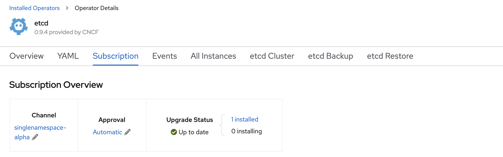
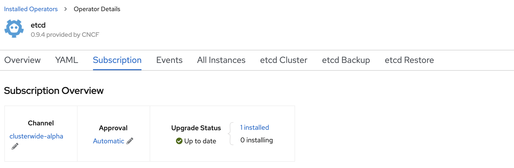

<!-- START doctoc generated TOC please keep comment here to allow auto update -->
<!-- DON'T EDIT THIS SECTION, INSTEAD RE-RUN doctoc TO UPDATE -->
**Table of Contents**  *generated with [DocToc](https://github.com/thlorenz/doctoc)*

- [How to update OperandRegistry instance](#how-to-update-operandregistry-instance)
  - [OperandRegistry Overview](#operandregistry-overview)
  - [Example](#example)
    - [1. ODLM has been deployed and OperandConfig, OperandRegistry and OperandRequest instances have been created](#1-odlm-has-been-deployed-and-operandconfig-operandregistry-and-operandrequest-instances-have-been-created)
    - [2. Etcd operator and operands has been created](#2-etcd-operator-and-operands-has-been-created)
    - [3. Update OperandRegistry](#3-update-operandregistry)

<!-- END doctoc generated TOC please keep comment here to allow auto update -->

# How to update OperandRegistry instance

OperandRegistry defines the OLM information, like channel and catalog source, for each operator.

## OperandRegistry Overview

OperandRegistry defines the individual operator info.

**NOTE:** When the ODLM operator is deployed, it generates a default OperandRegistry instance. You can edit the instance as required.

Following is an example of the OperandRegistry CR:

**NOTE:** The "name" parameter must be unique for each entry.

```yaml
apiVersion: operator.ibm.com/v1alpha1
kind: OperandRegistry
metadata:
  name: common-service [1]
  namespace: ibm-common-services [2]
spec:
  operators:
  - name: ibm-metering-operator [3]
    namespace: ibm-common-services [4]
    channel: alpha [5]
    packageName: ibm-metering-operator-app [6]
    sourceName: opencloud-operators [7]
    sourceNamespace: openshift-marketplace [8]
    description: The service used to meter workloads in a kubernetes cluster [9]
```

The Operand (Deployment) Registry Custom Resource (CR) lists OLM Operator information for operands that may be requested for installation and/or access by an application that runs in a namespace. The registry CR specifies:

  1. Name of the OperandRegistry
  2. Namespace of the OperandRegistry
  3. **name** is the name of the operator, which should be the same as the services name in the OperandConfig and OperandRequest.
  4. **namespace** is the namespace where the operator will be deployed.
  5. **channel** is the name of OLM channel that is subscribed for the operator.
  6. **packageName** is the name of the package in CatalogSource that is subscribed for the operator.
  7. **sourceName** is the name of the CatalogSource.
  8. **sourceNamespace** is the namespace of the CatalogSource.
  9. **description** is used to add a detailed description of a service.

**Note:** Only the channel can be updated for day2 operations.

## Example

Taking etcd operator as an example

### 1. ODLM has been deployed and OperandConfig, OperandRegistry and OperandRequest instances have been created

OperandConfig:

```yaml
apiVersion: operator.ibm.com/v1alpha1
kind: OperandConfig
metadata:
  name: common-service
  namespace: ibm-common-services
spec:
  services:
    - name: etcd
      spec:
        etcdCluster:
          size: 1
```

OperandRegistry:

```yaml
apiVersion: operator.ibm.com/v1alpha1
kind: OperandRegistry
metadata:
  name: common-service
  namespace: ibm-common-services
spec:
  operators:
    - channel: singlenamespace-alpha
      name: etcd
      namespace: etcd-operator
      packageName: etcd
      scope: private
      sourceName: community-operators
      sourceNamespace: openshift-marketplace
```

Set channel to `singlenamespace-alpha`.

OperandRequest:

```yaml
apiVersion: operator.ibm.com/v1alpha1
kind: OperandRequest
metadata:
  name: common-service
  namespace: ibm-common-services
spec:
  requests:
    - operands:
        - name: etcd
      registry: common-service
      registryNamespace: ibm-common-services
```

### 2. Etcd operator and operands has been created


ODLM and etcd operators are deployed.


Etcd operator custom resource `etcdcluster/example` is created



The Channel of etcd subscription is `singlenamespace-alpha`.

### 3. Update OperandRegistry

OperandConfig:

OperandRegistry:

```yaml
apiVersion: operator.ibm.com/v1alpha1
kind: OperandRegistry
metadata:
  name: common-service
  namespace: ibm-common-services
spec:
  operators:
    - channel: clusterwide-alpha
      name: etcd
      namespace: etcd-operator
      packageName: etcd
      scope: private
      sourceName: community-operators
      sourceNamespace: openshift-marketplace
```

Update etcd channel to `clusterwide-alpha`.



Etcd subscription channel is updated to `clusterwide-alpha`.
